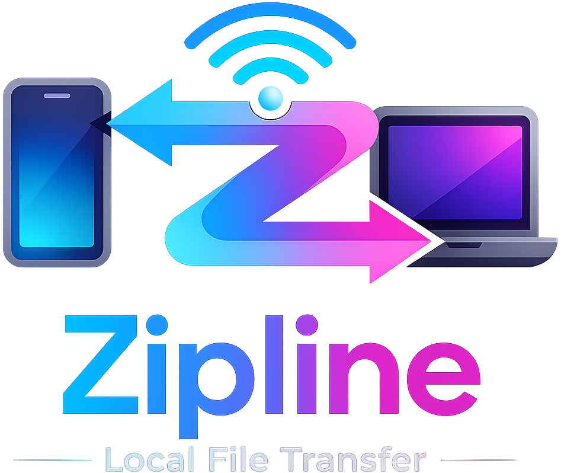

<p align="center">
  
</p>

<h1 align="center">ZipLine</h1>

<p align="center">
  Fast device-to-device file transfer for your local network.
  <br />
  No cloud storage. No account. No size limit.
</p>

<p align="center">
  <a href="https://pub-0cfcfe21f6bd432f943faca4b4b8a199.r2.dev/ZipLine-1.0.0.AppImage"><strong>Download AppImage</strong></a>
  ·
  <a href="https://pub-0cfcfe21f6bd432f943faca4b4b8a199.r2.dev/zipline-desktop_1.0.0_amd64.deb"><strong>Download .deb</strong></a>
</p>

<p align="center">
  
  
</p>

---

## What is ZipLine?

ZipLine is a desktop application for transferring files between devices on the same local network at full LAN speed, without requiring an internet connection. Open ZipLine, choose files or a folder, pick the receiving device, and send.

It is built for moments where cloud uploads feel unnecessary: sharing folders across a desk, passing project files to another laptop, or instantly connecting devices like iPhones and Android phones by scanning a QR code, or simply entering an IP address on another computer or laptop.

## Download

The current public build is compiled for **Linux x64**.

| System | Download | Notes |
| --- | --- | --- |
| Linux x64 | [ZipLine-1.0.0.AppImage](https://pub-0cfcfe21f6bd432f943faca4b4b8a199.r2.dev/ZipLine-1.0.0.AppImage) | Portable build. Download, make executable, run. |
| Debian / Ubuntu x64 | [zipline-desktop_1.0.0_amd64.deb](https://pub-0cfcfe21f6bd432f943faca4b4b8a199.r2.dev/zipline-desktop_1.0.0_amd64.deb) | Installer package for Debian-based distributions. |
| Windows | Coming later | A Windows build is planned for a future release. |

### Run the AppImage

```bash
chmod +x ZipLine-1.0.0.AppImage
./ZipLine-1.0.0.AppImage
```

### Install the Debian package

```bash
sudo apt install ./zipline-desktop_1.0.0_amd64.deb
```

## Why ZipLine?

- **Local-first transfers**  
  Files move across your network instead of being uploaded to cloud storage first.

- **No accounts**  
  Open the app and send. There is no sign-up flow or external dashboard to configure.

- **Large file friendly**  
  ZipLine is designed for big files and folders, with live progress and transfer speed feedback.

- **Device discovery**  
  Nearby devices running ZipLine appear automatically in the app.

- **QR/browser pairing**  
  The host device shows a QR code and local address so another device can join from a browser on the same network.

- **Accept or decline incoming files**  
  The receiver always gets a clear incoming transfer prompt before anything is accepted.

- **Desktop packaged**  
  The Linux build ships as both a portable AppImage and a Debian package.

## How it works

1. Open ZipLine on any device — it becomes a local network host.

2. Once running, any device on the same network can connect and exchange files directly with others.

3. To connect devices, you can:
- scan a QR code (e.g. from a phone or laptop), or
- manually enter the IP address shown on another device.

4. After devices discover each other, they become part of the same local network session, and files can be sent in any direction — phone to laptop, laptop to desktop, or desktop to phone.

5. Select files or a folder, choose the target device, and ZipLine streams the data over the local connection with live progress.

## Privacy

ZipLine is designed around direct transfer behavior. The app does not require an account, and files are not stored or routed through any cloud service.

All transfers happen locally between devices on your own network through the running ZipLine instances.

Your data never leaves your local network — there is no internet upload, no external servers, and no third-party access involved.

## Current platform support

ZipLine currently ships as a Linux x64 desktop app:

- AppImage for portable use
- `.deb` package for Debian and Ubuntu-based systems

Windows support is planned for a future release.

## Closed source notice

ZipLine is distributed as a closed-source product. The compiled application is provided for use, but the source code is not licensed for copying, redistribution, modification, or reuse unless explicit permission is granted by the owner.

---

<p align="center">
  Built for quick, private file movement between the devices already around you.
</p>
